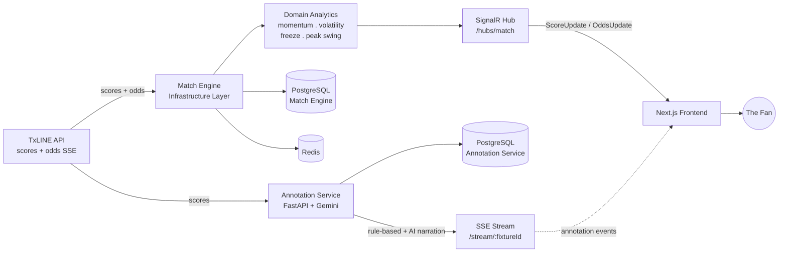

<p align="center">
  
  
  
  
  
  
</p>

<h1 align="center">PITCHLINE</h1>

<p align="center">
  <strong>Win probability. As a live market. For EVERY fan.</strong>
</p>

<p align="center">
  Built for the <strong>TxLINE World Cup Hackathon</strong> on Superteam Earn.<br/>
  A real-time probability chart for football, but with the volatility, momentum and market-freeze
  signals of an actual trading terminal all running on <strong>TxLINE's</strong> live feed and Solana identity.
</p>

<p align="center">
  <a href="https://pitchline-five.vercel.app/"><strong>Live App</strong></a> ·
  <a href="#"><strong>Demo Video</strong></a> ·
  <a href="#getting-started"><strong>Getting Started</strong></a> ·
  <a href="#txline-integration"><strong>TxLINE Integration</strong></a>
</p>

---

> **PITCHLINE turns live football win-probability into a trading terminal** — three probability lines, one shared story, updating in real time — with market analytics (momentum, volatility, freeze detection) running underneath and every meaningful spike annotated with the event that caused it.

---

## Table of Contents

- [The Problem](#the-problem)
- [The Solution](#the-solution)
- [See It In Action](#see-it-in-action)
- [Judging Criteria Alignment](#judging-criteria-alignment)
- [Key Features](#key-features)
- [Why This Is Different](#why-this-is-different)
- [How It Works](#how-it-works)
- [Tech Stack](#tech-stack)
- [TxLINE Integration](#txline-integration)
- [Solana Integration](#solana-integration)
- [Business Model](#business-model)
- [Getting Started](#getting-started)
- [Project Structure](#project-structure)
- [API Documentation](#api-documentation)
- [Our Experience With TxLINE](#our-experience-with-txline)
- [Roadmap](#roadmap)
- [Team](#team)
- [Acknowledgments](#acknowledgments)
- [License](#license)

---

## The Problem

Most fans watching the World Cup are doing it with a phone in their hand. The data that could make that experience dramatically richer is live win probabilities shifting as: goals, red cards and VAR decisions fire. It's historically been locked inside sportsbook interfaces that it's built for bettors, not fans!!!.

- **The Language problem** — odds are expressed in formats that mean nothing to a casual Sports fan (2.01, +1100, -500pts ???).
- **The Causality problem** — even fans who understand odds can't see *why* a probability just moved.
- **The Access problem** — this data has, until now, only been available to large operators. TxLINE changes that.

## The Solution

PITCHLINE renders a live football match as a trading terminal. Win probability for each team and the possibility of a draw, all plotted as a Live three-line chart. Underneath it's a market-analytics engine, tracking the same signals a real trading desk would with every significant probability shift is annotated with the event that caused it.

We never say "odds." We never say "betting." We say **probability**, **market**, **momentum**, **volatility**. That's not a cosmetic choice, it's what makes the product usable by a mainstream audience who'd never open a sportsbook, while being richer for the fans who would.

## See It In Action

<p align="center">
  <a href="#"><strong>▶ Watch the demo</strong></a>
</p>
<p align="center">
  
</p>

**Live deployment:** https://pitchline-five.vercel.app/

**Match Engine API:** https://pitchline.onrender.com/swagger/index.html

**Annotation Service API:** https://annotation-service-production.up.railway.app/docs

## Judging Criteria Alignment

Built against the TxLINE World Cup Hackathon's official rubric, point by point:

| Criterion | How PITCHLINE Delivers |
|---|---|
| **Fan Accessibility & UX** | Zero betting vocabulary anywhere in the product. Dedicated mobile interaction design: a commentary drawer, tap-to-prioritize annotations, a dominant-color area fill so whoever's leading is legible at a glance not just readable in the numbers. |
| **Real-Time Responsiveness** | A dual-channel realtime architecture: SignalR broadcasts score and odds the instant TxLINE fires them, on a completely separate channel from annotations — so a slow AI call can never block the live chart. Update latency is actively instrumented by a dedicated latency-tracking service in the frontend, not just assumed. |
| **Originality & Value Creation** | A pure domain layer computes momentum, VIX-style volatility, market-freeze detection and peak-swing tracking on every match, the same class of analysis a real trading desk runs, applied to a football match. Paired with a dual-tier annotation engine, this isn't available in any mainstream fan product today. |
| **Commercial & Monetization Path** | A working freemium model, see [Business Model](#business-model). TxLINE's own catalogue of 1000+ post-World-Cup leagues is the direct scaling path, with no new data partnership required. |
| **Completeness & Execution** | Fully deployed, fully functional, tested end-to-end against a real live match. The Match Engine ships dedicated historical-replay endpoints purpose-built for exactly the "no live match during review". |

## Key Features

- **Live three-line probability chart** — Team A(Home) / Draw / Team B(Away), always summing to 100% (thanks to TXLine's Demarginalized pct), with a dominant-color area fill showing who's leading at a glance
- **Market analytics engine** — live momentum, VIX-style volatility and peak-swing tracking, computed in a pure domain layer with zero infrastructure dependencies
- **Dual-tier annotation engine** — instant annotations for routine events, AI narration reserved for the moments that are genuinely dramatic
- **Dual-channel real-time architecture** — SignalR for score and odds, a fully independent SSE stream for annotations, so nothing in the AI pipeline can ever block the live chart
- **Built-in historical replay** — the Match Engine can replay any historical TxLINE fixture through the exact same ingestion and broadcast pipeline used for live matches
- **Live and historical market browsing** — a live overview, plus a dedicated finished-matches history view
- **Patch-based lobby updates** — the market overview merges live deltas into its initial rows instead of re-fetching, keeping many simultaneous live matches smooth
- **Mobile-first UX** — a dedicated commentary drawer and tap-to-prioritize annotation flow
- **Multi-wallet identity via Reown AppKit** — native Solana (`@solana/kit`) satisfies the hackathon's Solana requirement; wagmi/viem extend the same one-click flow to EVM wallets
- **Self-healing cache layer** — Redis-first reads with automatic Postgres fallback, plus an admin endpoint to resync the cache on demand
- **Independent, self-persisting annotation service** — its own TxLINE SSE ingestion, its own Postgres database and its own `/health` check, so it stays up and keeps a durable event history even under load on the odds pipeline

## Why This Is Different

Most sports data products are dashboards, numbers refreshed on a timer, no narrative, no deeper signal. PITCHLINE does two things nothing else in this space does:

**It runs real market analytics on a football match.** Momentum tells you whether a probability swing is accelerating or fading. A VIX-style volatility index tells you how turbulent the match currently is. Market-freeze detection recognizes when the probability line itself pauses the same signal a trading halt gives on a real exchange (which in football usually means a VAR review is underway). Peak-swing tracking holds onto the single biggest probability move of the match, the moment fans are most likely to screenshot and share.

**It explains causality, not just movement.** Every meaningful spike is paired with the event that caused it, instant and deterministic for routine events, AI-narrated for the handful that are genuinely dramatic. The financial-market framing itself removes the gambling stigma: a parent watching with their kid, a casual fan and a stats-obsessed fan can all use the same product without it ever reading as a "betting" app.

## How It Works



**The data flow, step by step:**

1. On page load, the frontend fetches an initial snapshot directly from the Match Engine/fixture index, current match state, odds/event history and annotation history, before any live connection opens
2. The Match Engine's Infrastructure layer ingests TxLINE's score and odds SSE streams continuously, enriching every event with fixture metadata
3. Every event is written durably to PostgreSQL (the system's source of truth) then mirrored into Redis for ultra-fast reads
4. Odds events additionally pass through a pure Domain layer that computes momentum, volatility, market-freeze state and peak-swing
5. The enriched update broadcasts over SignalR to every client subscribed to that fixture's group
6. **In parallel, the Annotation Service opens its own direct SSE connection to TxLINE** — it does not depend on the Match Engine for event data and a fixture-watcher cron job tells it which fixtures to start and stop watching. It scores significance, applies deterministic rule templates for routine events and sends dramatic moments to AI narration
7. Every annotation is written durably to the Annotation Service's own PostgreSQL database, so annotation history survives independently of the odds pipeline, then pushed to the frontend over its own dedicated SSE stream so nothing in the AI 

## Tech Stack

**Frontend**

| Category | Technology |
|---|---|
| Framework | Next.js 16, React 19, TypeScript |
| Styling | Tailwind CSS 4, radix-ui, lucide-react, class-variance-authority, clsx, tailwind-merge |
| Animation | motion/react |
| Validation | Zod — every backend response is validated before it reaches the mapper layer |
| Data fetching | Native fetch (`services/pitchline-http.ts`); `@tanstack/react-query` installed and provisioned |
| Realtime | `@microsoft/signalr` (score/odds), native `EventSource` (annotation stream) |
| Charts | `lightweight-charts` (TradingView), custom utilities in `components/probability-chart/` |
| Wallet | Reown AppKit, wagmi, viem (EVM), `@solana/kit` (Solana) |

**Match Engine — Backend**

| Category | Technology |
|---|---|
| Runtime | .NET 9, ASP.NET Core Web API, C# |
| Architecture | Clean Architecture — Domain / Application / Infrastructure / API, four separate projects |
| CQRS | MediatR — every query/command runs through a dedicated handler, keeping controllers thin |
| Validation | FluentValidation |
| Persistence | PostgreSQL (Npgsql) as source of truth, Redis (StackExchange.Redis) as live cache |
| Realtime | SignalR hub, SSE client for TxLINE ingestion |
| Observability | Serilog structured logging, Swagger/Swashbuckle, `/healthz` |

**Annotation Service — Backend**

| Category | Technology |
|---|---|
| Framework | FastAPI (Python), SQLAlchemy 2.0 (async) |
| AI | Gemini 2.5 Flash/Groq Llama 3.3 70B  |
| Logic | Significance scorer + deterministic rule engine |
| Persistence | PostgreSQL via async SQLAlchemy|
| Realtime | Its own SSE stream direct to the frontend, decoupled from the Match Engine's SignalR hub |
| Ingestion | Direct TxLINE SSE consumer with auto-reconnect + `Ts` resume |
| Scheduling | Fixture watcher cron  |
| Observability | `GET /health` |

## TxLINE Integration

**Consumed by the Match Engine's Infrastructure layer:**

| Endpoint | Type | Used For |
|---|---|---|
| `/api/scores/stream` | SSE | Live goals, cards, phase changes, match minute derived from `Clock.Seconds / 60` |
| `/api/odds/stream` | SSE | Live consensus odds, filtered to the full-match `1X2_PARTICIPANT_RESULT` market only |

**Consumed independently by the Annotation Service:**

| Endpoint | Type | Used For |
|---|---|---|
| `/scores/stream?fixtureId={id}` | SSE | Live match events: goals, cards, subs, VAR, etc. with automatic reconnect and `Ts` checkpointing |

Probability calculation prefers TxLINE's own percentage array when supplied helping skip demarginaliztion.

**PITCHLINE's API surface :**

| Endpoint | Method | Purpose |
|---|---|---|
| `/api/Fixtures` | GET | Live market overview |
| `/api/Fixtures/finished` | GET | Historical market overview |
| `/api/Match/{fixtureId}` | GET | Current match snapshot |
| `/api/Match/{fixtureId}/history` | GET | Odds history and event log for a fixture |
| `/hubs/match` | SignalR | Live `ScoreUpdate` / `OddsUpdate`, joined via `JoinFixture` or `JoinLobby` |
| `annotation-service-production.up.railway.app/history/{fixtureId}` | GET | Annotation history |
| `annotation-service-production.up.railway.app/stream/{fixtureId}` | SSE | Live annotation narration |

**Built for Replay:**  The Match Engine ships dedicated replay endpoints:

```
POST /api/Simulate/replay-historical/{fixtureId}
POST /api/Simulate/replay-odds/{fixtureId}
POST /api/Admin/seed-history/{competitionId}
```

These replay real TxLINE historical data through the identical ingestion, persistence and broadcast pipeline used for live matches, not a canned demo mode.

## Solana Integration

**Live today:**

- Wallet connection is unified through Reown AppKit. Solana support via `@solana/kit` satisfies the hackathon's sign-up-through-Solana requirement; wagmi and viem extend the same one-click flow to EVM wallets
- Wallet-based identity: NO email or password anywhere in the product.
- TxLINE's own data subscription is activated via an on-chain Solana transaction, the data layer itself is Solana-anchored not just the login screen

**Roadmap (deliberately out of scope for this hackathon slice):**

- SOL micro-predictions with on-chain settlement, verified via TxLINE's Merkle-proof system
- Full prediction market with wallet-tied leaderboards

## Business Model

| Tier | Price | Includes |
|---|---|---|
| **Free** | $0 | Live match terminal, event annotations, live and historical market overview |
| **Fan+** | $TBA | Everything in Free, plus full annotation history, extended market analytics, all TxLINE-covered leagues post-World Cup |
| **Pro / B2B** | Custom | Embeddable widget, broadcast overlay license, direct API access |

Post-hackathon, TxLINE's own catalogue of 1000+ leagues is the direct path to scaling this product far beyond the World Cup, no new data partnership required. Just a tier upgrade on infrastructure already integrated.

## Getting Started

**Prerequisites**

- .NET 9 SDK
- Python 3.11+
- Node.js 20+
- A TxLINE API token ([Quickstart](https://txline.txodds.com/documentation/quickstart))
- A Redis instance
- A PostgreSQL instance
- A Gemini/Groq API key

<details>
<summary><strong>Match Engine (.NET 9, Clean Architecture)</strong></summary>

```bash
cd match-engine
cp PitchLine.API/appsettings.example.json PitchLine.API/appsettings.json
# fill in: TxLine API token, Redis connection string, Postgres connection string

dotnet restore
dotnet run --project PitchLine.API
```

- Swagger docs: https://pitchline.onrender.com/swagger/index.html
- Health check: https://pitchline.onrender.com/healthz

</details>

<details>
<summary><strong>Annotation Service (FastAPI)</strong></summary>

```bash
cd annotation-service
python -m venv venv && source venv/bin/activate
pip install -r requirements.txt
cp .env.example .env
# fill in: TXLINE_BASE_URL, TXLINE_API_KEY, TXLINE_JWT_TOKEN,
#          GEMINI_API_KEY/GROQ_API_KEY, DATABASE_URL,
#          MAIN_APP_URL, CRON_INTERNAL_SECRET

uvicorn main:app --reload --port 8000
```

- Interactive docs: https://annotation-service-production.up.railway.app/docs
- Health check: https://annotation-service-production.up.railway.app/health
- History: `GET /history/{fixtureId}`
- Live stream: `GET /stream/{fixtureId}` (SSE)

</details>

<details>
<summary><strong>Frontend (Next.js 16)</strong></summary>

```bash
cd client
npm install
cp .env.local.example .env.local
# fill in: NEXT_PUBLIC_MATCH_ENGINE_URL, NEXT_PUBLIC_ANNOTATION_SERVICE_URL,
#          Reown project ID, Solana RPC URL

npm run dev
```

Runs on `http://localhost:3000`.

</details>

## Project Structure

```
pitchline/
├── client/                       Next.js 16 frontend
│   ├── app/                      Next.js app routes
│   ├── components/               UI components and feature views
│   ├── hooks/                    live/replay stream state hooks
│   ├── services/                 API clients, DTO mappers, backend integration
│   ├── schemas/                  Zod schemas for backend contracts
│   ├── lib/                      shared types, mock/replay data, utilities
│   └── config/                   API and wallet config
├── match-engine/                 .NET 9 — Clean Architecture
│   ├── PitchLine.API/            Controllers, SignalR hub, startup
│   ├── PitchLine.Application/    MediatR handlers, DTOs, repository interfaces
│   ├── PitchLine.Domain/         Pure market analytics: momentum, volatility, freeze, peak swing
│   └── PitchLine.Infrastructure/ TxLINE ingestion, Redis, Postgres, SignalR bus
└── annotation-service/           FastAPI — direct TxLINE SSE, significance scoring, rule engine, AI narration
    ├── app/
    │   ├── api/                  routes, SSE publisher, clock anchors, health check
    │   ├── core/                 config
    │   ├── db/                   database models (own Postgres instance)
    │   ├── ingestion/            TxLineClient, StreamManager
    │   ├── processing/           RuleEngine, EntityResolver, Significance, AIService
    │   └── services/             AnnotationService, HistoryService, CommentaryService, clock anchors
    └── main.py
```

## API Documentation

- **Match Engine (Swagger):** https://pitchline.onrender.com/swagger/index.html
- **Match Engine health:** https://pitchline.onrender.com/healthz
- **Annotation Service (FastAPI-docs):** https://annotation-service-production.up.railway.app/docs
- **Annotation Service health:** https://annotation-service-production.up.railway.app/health

## Our Experience With TxLINE

*This section reflects our team's direct, hands-on experience integrating the TxLINE API*

**What we liked most:**

- *Well-Strcutured Endpoints to be able to call matches that were played before implementation meant we could backfill statistical data easily by calling them in 5-min Chunks*
- *[Ts]: returned seperately from [clock]: seconds meant we could figure the difference in odds probability provided after the first half and reallign the chart*
- *Ultra Fast SSE meant we get data the second an event occurs*
- *The single normalised JSON schema across competitions meant the probability calculator didn't need per-league special-casing*
- *Being able to use TxLINE's own percentage array and only fall back to computing implied probability manually simplified the odds pipeline*
- *Demarginalized odds meant our entire pipeline could skip the process of having to edit and refine pct returned by TXline during live SSE*


**Where we hit friction:**

- *[action_amend] events frequently omit Data.Id for the entity being amended, the team had to fall back to matching by Previous.Clock.Seconds instead, which breaks when two events land in the same match minute. action_discarded doesn't have this problem, since it always includes the target Id directly. We'd love to see action_amend carry Data.Id consistently, the same way action_discarded does*
- *[Corner] & [shot] events don't carry a PlayerId the way goals, cards, and other actions events do, so attributing a corner or shot to the specific player currently means deriving it from aggregate stats rather than reading it directly off the event*
- *Odds history returned through paginated chunks was occasionally incomplete for individual fixtures even when the full match odds epoch was requested ...for example: fixtureId: 17588231 (among 9+ others) came back with gaps in its odds history*
- *Competition ID 72 (World Cup) returned 106 logged fixtures instead of the expected 104. Two fixtures (17588394 and 17588400) appeared to have leaked in from another competition (we presume a virtual-match league) and had to be explicitly filtered out on the Match Engine side*
- *StatusId -> phase mapping had to be reverse-engineered from real match data rather than pulled from documentation. We confirmed it against several real matches, including ones that went to extra time and penalties, but without an authoritative status-code reference we can't fully rule out edge cases; A golden-goal finish for instance using a different sequence*

## Roadmap

- [ ] SOL micro-predictions with on-chain, Merkle-proof-verified settlement
- [ ] Surface live latency metrics directly in the product UI, building on the existing latency-tracking service
- [ ] A shareable "match stats" card built from the existing momentum/volatility/peak-swing engine
- [ ] Broadcast overlay product for TV and streaming partners
- [ ] Native mobile app
- [ ] Multi-language AI narrative annotations

## Team

| Role | Focus |
|---|---|
| Backend Engineer — Annotation Service | Israel Adetubo — FastAPI, direct TxLINE ingestion, significance engine, AI integration |
| Backend Engineer — Match Engine | Odufowokan Ayotomiwa — .NET 9, Clean Architecture, real-time SSE pipeline, SignalR |
| Frontend Engineer | Joseph Ajogu — Next.js, live chart, Solana-wallet integration |

## Acknowledgments

- **TxLINE / TxODDS** — for the live World Cup data feed and waiving commercial fees for this hackathon
- **Superteam Earn** — for hosting the hackathon
- **Google** — Gemini 2.5 Flash, powering our narrative annotations
- **Solana** — the identity layer this product is built on

## License

Released under the [MIT License](./LICENSE).

---

<p align="center">
  <sub>Built in Public for the TxLINE World Cup Hackathon · July 18, 2026</sub>
</p>